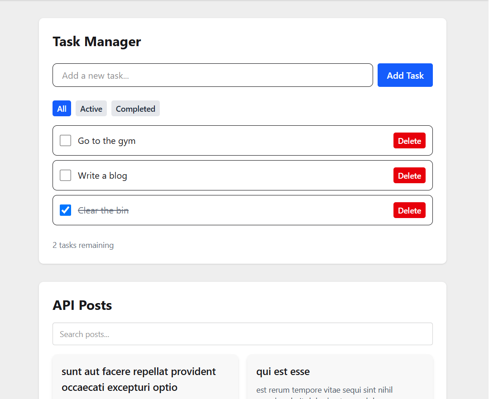

# PLP Task Manager

A responsive Task Manager web application built with **React**, **Tailwind CSS**, and **DaisyUI**, featuring task management, API integration, and light/dark theme support.

---

## 📌 Deployed URL

[View Live App](https://react-js-jsx-and-css-mastering-fron-rho.vercel.app/)

---

## 🖼 Screenshot



---

## 🗂 Project Structure
```
task-manager/
├── public/
│ └── index.html
├── src/
│ ├── components/
│ │ ├── ApiData.jsx
| | ├── Button.jsx
| | ├── Card.jsx
| | ├── Footer.jsx
│ │ ├── Layout.jsx
│ │ ├── Navbar.jsx
│ │ └── TaskManager.jsx
| ├── context/
│ │ └── ThemeContext.js
│ ├── pages/
│ │ └── Home.jsx
│ ├── App.jsx
│ ├── index.jsx
│ └── main.jsx
├── jsconfig.app.json.json
├── jsonconfig.json
├── package.json
├── package-lock.json
└── README.md
```


---

## ⚙️ Installation & Setup

### 1. Clone the repository
```bash
git clone https://github.com/your-username/plp-task-manager.git
cd plp-task-manager
```
### 2. Install dependencies
```bash
npm install
```

### 3. Install Tailwind CSS & DaisyUI (if not yet installed)
```bash
npm install tailwindcss @tailwindcss/vite
npm i -D daisyui@latest
```

Replace everything in `src/index.css` with the following:

```css
@import "tailwindcss";
```

### 4. Run the development server:
```bash
npm run dev
```

### 5. Open the app in your browser at `http://localhost:5173` (or the port Vite provides).
---


---

## 🚀 Features

| Concept | Description |
|---------|-------------|
| React Hooks | Uses `useState`, `useEffect`, and `useContext` for state & theme management |
| Custom Hooks | `useLocalStorageTasks` for task persistence |
| Reusable Components | `Button`, `Card`, `Navbar`, and `Footer` components with props |
| API Integration | Fetching, searching, and paginating JSONPlaceholder posts |
| Dark Mode | Context-powered light/dark theme switcher |
| Responsive UI | Built with Tailwind’s responsive utility classes |
| Animations | Smooth hover transitions using Tailwind’s transform and duration utilities |

---

## 🧰 Scripts

| Command | Description |
|---------|-------------|
| `npm run dev` | Starts the development server |
| `npm run build` | Builds the app for production |
| `npm run preview` | Serves the production build locally |

---

## 📦 Environment

| Requirement | Recommended Version |
|-------------|------------------|
| Node.js | v18 or higher |
| NPM | v9 or higher |
| Vite | Latest |
| React | 18.x |
| Tailwind CSS | 4.x |
| DaisyUI | Latest |

---

## ✨ Features Implemented

- Add, edit, and delete tasks
- Mark tasks as completed
- Persist tasks in local storage
- Fetch posts from JSONPlaceholder API
- Search and paginate API results
- Light/dark theme toggle with context
- Fully responsive layout for mobile, tablet, and desktop
- Smooth hover and transition animations

---

---
## 🧩 Future Enhancements

- Task editing functionality ✏️

- User authentication flow 🔐

- Drag-and-drop task reordering 🧲

- Integration with a real backend API ⚙️
---